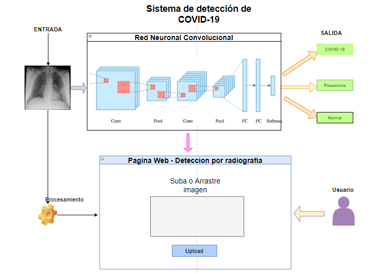
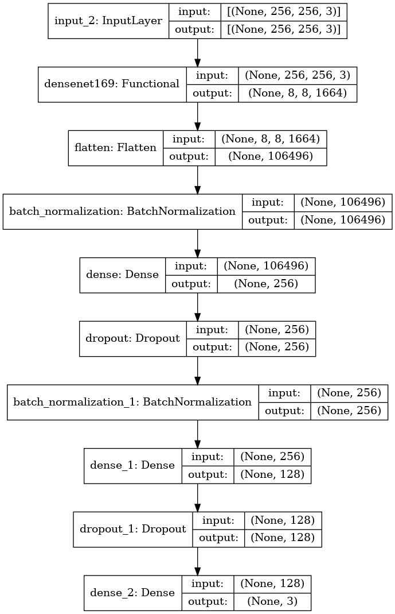

# Modelo para la detección de COVID-19 en base a radiografias de Rayos-X

* [**Paper completo del proyecto. Aquí 👀📚**](Informes/INFORME_FINAL.pdf)
* Modelo en produccion: [Click Here!](https://share.streamlit.io/jovamih/covid19detectorapp/main/app.py)

Repositorio con el modelo para la deteccion de COVID-19 a partir de radiografias de rayos-X

* Se usó la metodologia de mineria de datos **CRISP-DM**

* El proyecto busca realizar una deteccion temprana de COVID-19 a partir de radiografias de Rayos-X
### Herramientas utilizadas

Estas fueron:

* Tensorflow
* Keras
* Scikit-Learn
* Matplotlib
* Pandas
* Numpy

## Aplicacion de CNN: Redes Neuronales Convolucionales

* Se aplicó CNN junto con la arquitectura DenseNet169 de Google

### El autor:
* Johan Valerio Mitma, 20 años UNMSM- Perú
* IG: https://www.instagram.com/johan_mitma12/
* Twt: https://twitter.com/JohanMitma12
